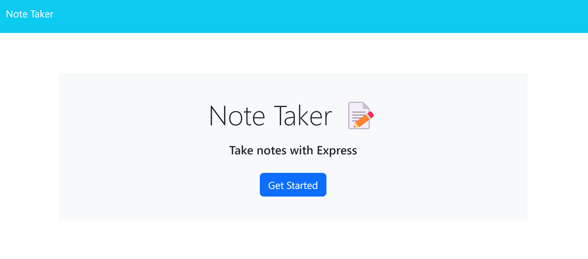
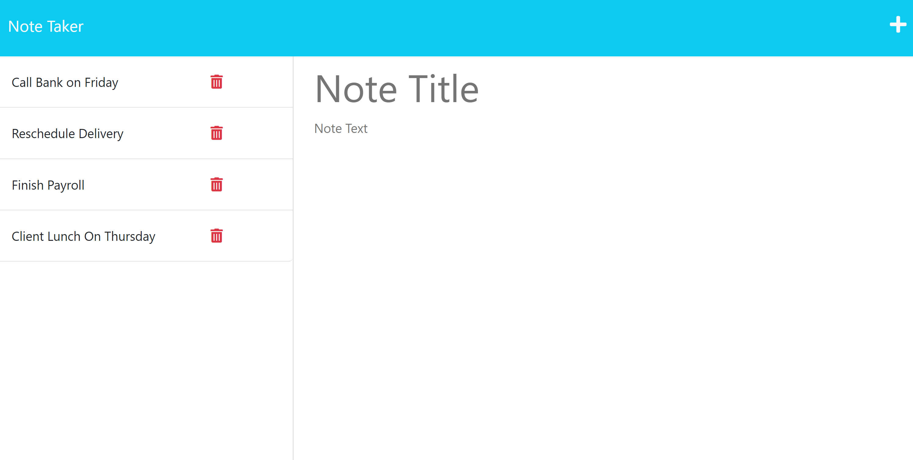

# buisness-note-taker
## Description
- This application keeps track of notes and thoughts for a buisness! The app runs on heroku with a fully developed front end and back end.  
- I built this to enable a buisness to stay organized.
- One of the biggest lessons learned during this project was the use of expressjs for back-end architecture.
- During this project I got to work with the express npm dependency including get, post and delete methodology get a better grasp on the nodejs file system methods such as fs.writeFile(), fs.readFile() and fs.appendFile(), work with Heroku to deploy a webpage, get a deeper understanding of package.json and work with a back end + front end file structure system.

* [Installation](#installation)
* [Usage](#usage)
* [Credits](#credits)
* [License](#license)
## Installation

After cloning repo, please make sure you have nodejs installed then run the following command:
```
npm i
```
Then to deploy the application locally run the following command:
```
node server.js
```

## Usage

Instructions and examples for use including screenshots and github repo/page.

- Click link to view repo: [Github Repo](https://github.com/Git-Vdim-Hub/buisness-note-taker)
- Click link to view deployed webpage on [Heroku](https://fathomless-garden-23793.herokuapp.com/)
- Screenshots: 
    

## Credits

This application was built with the use of [nodejs](https://nodejs.dev/en/) and the npm library 
[expressjs](https://expressjs.com/). Finally [heroku](https://www.heroku.com/) was used for deployment.

## License

[MIT](https://choosealicense.com/)